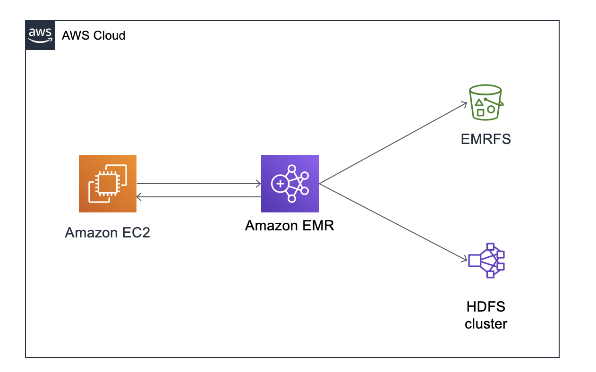

# 如何配置EC2作为现有EMR的edge node？

## 场景概述

EMR是AWS托管的数据分析服务，可以轻松运行和扩展Spark，hadoop，HBase，presto，hive等数据框架。常见的做法是在启动EMR时配置集群，选定所需要的节点数量。然而，在某些特定的场景下，我们希望将EC2 instance作为现有EMR集群的一个edge computing node. 这样的场景包含但不局限于，有多个EMR集群，希望在同一台EC2上提交任务；原有EC2已有大量的数据或者模型希望可以直接用于EMR集群等等。在这种情况下，我们需要把EC2配置为EMR的一个client，以便我们既可以从EC2轻松读取HDFS或是EMRFS的数据，也可以通过EC2为EMR集群提交hadoop相关的任务


## 架构图



## 步骤：

总体来说，该方案的配置步骤包含，一将现有EMR配置导出（到S3），二EC2安装相应的hadoop组件并且将配置拉取到本地，三修改网络配置使得他们互通。

如果EMR本身组件以及配置文件较少，可以直接利用scp的方式将Hadoop的配置文件发送到EC2即可，但因为外面开源的hadoop包可能会少一些对EMRFS的支持，所以以下方式将整套配置文件都导出来到EC2上。以下为具体方法。

### 0. 实验环境概述
本文的实验环境基于java 1.8.0,hadoop 2.8.4,spark 2.3.1, hive 2.3.3。对应的EMR环境为EMR-5.16.0。也可以用其他的环境，但是必须保证EC2与EMR使用的版本是相同的。


### 1. 将EMR现有的配置文件导出传到S3 

在EMR master集群上执行：

需要替换${1%/}为配置要上传到的S3的路径，如s3://bucket-name/path

```
#!/bin/bash

#${1%/}为配置要上传到的S3的路径 如s3://bucket-name/path
emrClientDepsPath=${1%/}/emr-client
echo "EMR client dependencies path: "$emrClientDepsPath

cd /mnt
mkdir t
cd t

mkdir -p ./etc/hadoop/conf
cp -a /etc/hadoop/conf/yarn-site.xml ./etc/hadoop/conf/
cp -a /etc/hadoop/conf/core-site.xml ./etc/hadoop/conf/

#打包了hive的配置文件
mkdir -p ./etc/hive/conf
cp -a /etc/hive/conf/* ./etc/hive/conf/

# spark的配置文件
mkdir -p ./etc/spark/conf
cp -a /etc/spark/conf/* ./etc/spark/conf/

#相应的lib文件
mkdir -p ./usr/lib
cp -a /usr/lib/hbase ./usr/lib
cp -a /usr/lib/hadoop ./usr/lib
cp -a /usr/lib/hadoop-lzo ./usr/lib
cp -a /usr/lib/hadoop-hdfs ./usr/lib
cp -a /usr/lib/spark ./usr/lib
rm -f ./usr/lib/spark/work
mkdir ./usr/lib/spark/work

#其他要share的文件

#share文件
mkdir -p ./usr/share
cp -a /usr/share/aws ./usr/share

rm -rf ./usr/share/aws/emr/instance-controller
rm -rf ./usr/share/aws/emr/hadoop-state-pusher


#把所有的配置文件都pack好 打包成一个tgz存到S3上
tar cvfz ../awsemrdeps.tgz .
cd ..
aws s3 cp awsemrdeps.tgz $emrClientDepsPath/

```


#### 2 EC2拉取EMR的配置文件到本地并安装相应的lib

在作为edge node的EC2中执行：

需要配置的参数有：

* s3Repo为hadoop和spark等安装包所在位置，也可以直接用wget下载原始bin文件安装

* s3UploadPath为EMR配置文件所在的路径，如上文的s3://bucket-name/path


注意事项：EC2的hadoop spark hive等版本号必须和EMR保持一致，不然会失败

```

#!/bin/bash

# s3Repo为hadoop和spark等安装包所在位置，也可以直接wget下载原始bin文件安装
# 但一定要注意，EMR的版本号和EC2必须一致，不然会失败

s3Repo=s3://aws-emr-resources-7-us-east-1/ec2-as-emr-edge-node
s3UploadPath=s3://aws-emr-resources-1234342352-us-east-1/tmp

echo "S3 repo path: "$s3Repo
echo "S3 upload path: "$s3UploadPath

cd /home/ec2-user
mkdir download

# Upgrade Java
yum install -y java-1.8.0
yum remove -y java-1.7.0-openjdk

# Download applications
# 根据情况，这一步可省略  用wget也可以
aws s3 cp $s3Repo/apps/ download/ --recursive

# Install Hadoop
tar xfz download/hadoop-2.8.4.tar.gz
ln -s /home/ec2-user/hadoop-2.8.4 /usr/lib/hadoop
rm -rf /usr/lib/hadoop/share/doc*

# Install Spark
tar xfz download/spark-2.3.1-bin-hadoop2.7.tgz  
ln -s /home/ec2-user/spark-2.3.1-bin-hadoop2.7 /usr/lib/spark

# Install其他所需要的软件 如hive
# 注意版本！

cd /

# emrDepsFilePath为 EMR配置所在的位置
fileDeps=awsemrdeps.tgz
emrDepsFilePath=$s3UploadPath/$fileDeps

aws s3 cp $emrDepsFilePath .

#解压配置文件到根目录
tar xfz ${fileDeps}
rm -f ${fileDeps}

# Client will create directories under /mnt for buffering
chmod 777 /mnt


# Configure environment variables for user
echo "export SPARK_HOME=/usr/lib/spark"  >> /home/ec2-user/.bashrc
echo "export HADOOP_HOME=/usr/lib/hadoop" >> /home/ec2-user/.bashrc
echo "export HADOOP_CONF_DIR=/usr/lib/hadoop/etc/hadoop" >> /home/ec2-user/.bashrc
echo "export JAVA_HOME=/etc/alternatives/jre" >> /home/ec2-user/.bashrc

echo "SPARK_HOME=/usr/lib/spark"  >> /home/ec2-user/.Renviron
echo "HADOOP_HOME=/usr/lib/hadoop" >> /home/ec2-user/.Renviron
echo "HADOOP_CONF_DIR=/usr/lib/hadoop/etc/hadoop" >> /home/ec2-user/.Renviron
echo "JAVA_HOME=/etc/alternatives/jre" >> /home/ec2-user/.Renviron

# The default SQL catalog implementation for Spark 2.3.x+ is "in-memory" instead of "hive". The sparklyr library cannot properly cope with correctly setting/enabling hive-support programmatically.
# 可省略
echo "spark.sql.catalogImplementation   hive"   >> /etc/spark/conf/spark-defaults.conf


chown -R ec2-user:ec2-user /home/ec2-user
```


### 3 调整EMR和EC2的安全组，使得他们能够互相内网访问

* EMR：

| Type | Protocol | Range | Source | Desp |
| --- | --- | --- | --- | --- |
| All | TCP | 0 - 65535 | sg-036275e050fc2b246 | EC2的安全组 |


* EC2配置以下安全组，除此之外，需要一个role，有访问S3的权限

| Type | Protocol | Range | Source | Desp |
| --- | --- | --- | --- | --- |
| All | TCP | 0 - 65535 | sg-036275e050fc2b256 | EMR的安全组 |


### 4 测试

* 首先检测安全组是否配置成功，EC2是否可以内网访问到EMR 
* 运行指令 
```
sudo $SPARK_HOME/bin/spark-shell
```
查看database，table等，此时HDFS和EMRFS的数据都可以读到
```
spark.sql("show tables").show
spark.sql("select * from ny_taxi_s3 limit 10").show
```

### 常见错误排查：NoClassdefFounderror

(1) 检查hadoop和相应软件的版本号是否一致

(2) 检查$HADOOP_HOME, $HIVE_HOME等路径是否正确

(3）如果有进一步的报错，结合which hive（或是hadoop）然后vim /path-to/hive查看hive配置等


### 参考文档

https://aws.amazon.com/cn/blogs/big-data/launch-an-edge-node-for-amazon-emr-to-run-rstudio/

https://cwiki.apache.org/confluence/display/Hive/GettingStarted#GettingStarted-Hive,Map-ReduceandLocal-Mode
